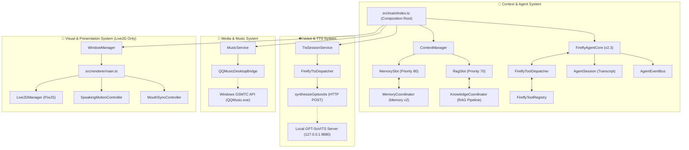

# Firefly-Pet (流萤桌宠) - V2.3.0

> 🚀 **Firefly Desktop AI Agent** — 基于 Electron + TypeScript + PixiJS Live2D + GPT-SoVITS + Windows GSMTC + Memory v2 + RAG 知识库检索的流萤桌面智能体。

---

## 📌 版本状态 (Release Status)

- **当前版本**：`V2.3.0`
- **基线状态**：**COMPLETE / FROZEN** (核心基线已完全冻结)
- **基线规范**：[docs/v1/v1-baseline.md](docs/v1/v1-baseline.md) | [docs/v2/v2.3-final-audit.md](docs/v2/v2.3-final-audit.md)
- **架构文档**：[docs/architecture/firefly-agent-architecture.md](docs/architecture/firefly-agent-architecture.md) | [docs/v2/v2.3-rag-architecture.md](docs/v2/v2.3-rag-architecture.md)

---

## 🌟 核心特性 (Features)

1. **FireflyAgentCore (智能体核心)**：
   - 深度解耦的 Agent Loop 架构，实现 `IAgentCore` 接口。
   - 具备 Context 层解耦、Tool Policy 策略控制、多步骤有界规划（Bounded Planner）与断点容灾恢复（Recovery Manager）。
   - 防崩溃事件总线 (`AgentEventBus`) 与防御性消息隔离 (`AgentSession`)。

2. **Memory v2 (分层认知记忆系统)**：
   - L0 工作记忆 / L1 短期情境 / L2 长期语义三层分级架构。
   - 5 维记忆加权打分检索器（Exact, Partial, Entity, Importance, Recency）。
   - 记忆生命周期演进：Ebbinghaus 衰减引擎、冲突消解仲裁（Conflict Resolver）与访问升阶整合（Consolidator）。
   - `MemorySlot` 插槽化装配（优先级 80），统一 `TokenMeter` 预算管理与只读上下文投影。

3. **RAG 知识库检索增强 (Canonical Knowledge Corpus & Hybrid Retrieval)**：
   - 官方只读知识库语料（`resources/`，806 文件）自动化切片解析，生成 5,665 个标准化切片与 SHA-256 清单。
   - 稠密向量存储（`FileVectorStore`）具备原子落盘与损坏自动备份恢复机制。
   - 词法倒排 + 稠密向量双流召回，5 维重排序打分（`KnowledgeReranker`）与对抗性相关性门控（Adversarial Gating）。
   - `RagSlot` 插槽化装配（优先级 70），800 Token 预算控制与故障安全隔离。
   - *注：生产语义 Embedding 维持已知限制标记 `PRODUCTION EMBEDDING: NOT QUALIFIED`（由确定性测试 Provider 支持基础向量与自动化回归）。*

4. **桌面交互与 Live2D 表现 (Live2D Presentation - Live2D Only)**：
   - 纯粹的 Live2D Cubism 3 模型 (`Firefly.model3.json`) 渲染，具备鼠标眼球注视追踪与肢体动作联动。
   - 10 项当前核心 Live2D 动作，6 项 Motion，11 项 Expression，零 PNG 序列帧依赖。
   - 像素级透明度采样（`alphaThreshold: 15`）、鼠标穿透与拖拽交互。

5. **动态流萤 AI Voice (GPT-SoVITS AI Voice)**：
   - 接入本地独立运行的 GPT-SoVITS 推理服务（`http://127.0.0.1:9880/tts`）。
   - 语音播放驱动 Live2D `talking` 动作与 `MouthSyncController`（`ParamMouthOpenY`）实时口型同步。

6. **系统媒体控制 (QQ Music GSMTC)**：
   - 通过 Windows GSMTC (Global System Media Transport Controls) API 深度桥接本地运行的 `QQMusic.exe`。
   - Agent 原生支持查询当前播放曲目、艺术家、进度并执行播放/暂停/切换控制。

---

## 🏗 系统架构 (Architecture)

### 架构全景图



---

## 📁 目录结构 (Directory Structure)

```text
Firefly-Pet/
├── assets/firefly/            # 角色模型、特化音效与 UI 资产
│   └── models/                # Live2D Cubism 3 模型配置与资源 (唯一角色表现)
│       ├── Expressions/       # 11 项表情配置 JSON
│       ├── Motions/           # 6 项动作配置 JSON
│       └── Firefly.model3.json# 主配置文件
├── config/                    # 运行时配置与默认模板 (忽略敏感数据)
│   └── settings.example.json  # 默认配置模板
├── docs/                      # 核心架构与阶段审计文档
│   ├── architecture/          # 架构全景规范
│   ├── v1/                    # V1 冻结基线与审计
│   └── v2/                    # V2 架构演进与全阶段交付报告
├── resources/                 # 官方只读规范知识语料库 (806 个源文件)
├── src/
│   ├── main/                  # Electron 主进程 (AgentCore, Memory, RAG, TTS, Music, Windows)
│   ├── preload/               # 上下文隔离 Preload 脚本
│   ├── renderer/              # PixiJS Live2D 渲染与 React 交互 UI
│   └── shared/                # 跨进程类型定义与通信信道
└── tools/                     # 回归测试套件与 Python 资产校验工具
```

---

## 🚀 快速上手 (Quick Start)

### 1. 环境依赖
- **Node.js**: >= 18.0.0
- **操作系统**: Windows 10 / 11 (GSMTC 媒体控制支持)
- **GPT-SoVITS**: 本地独立运行的 GPT-SoVITS 服务（端口 9880）
- **Python**: >= 3.10 (用于运行资产校验脚本)

### 2. 安装与配置
```powershell
# 克隆仓库
git clone https://github.com/Serendipity-wu02/Firefly_Agent.git
cd Firefly_Agent

# 安装依赖
npm install

# 复制默认配置
Copy-Item config/settings.example.json config/settings.json
```

### 3. 本地运行与构建
```powershell
# 类型检查
npm run typecheck

# 编译构建
npm run build

# 启动桌宠 (生产模式)
npm start

# 开发模式 (热重载)
npm run dev
```

---

## 🧪 测试与验证 (Testing & Verification)

Firefly-Pet 配备严格的多层级回归测试体系（23 个测试套件，299 项自动化测试全部通过）：

```powershell
# 1. 运行主回归测试套件 (包含 Agent Core, Context, Memory v2, RAG, Live2D)
npm test

# 2. 运行 Python 资产与逻辑校验套件 (5 项全部通过)
python tools/validate_ai_intent.py
python tools/validate_asset_structure.py
python tools/validate_character_resources.py
python tools/validate_firefly_assets.py
python tools/validate_persistence.py

# 3. 运行实机 GPT-SoVITS 联调测试 (需启动本地 GPT-SoVITS 服务)
node tools/verify_live_voice.mjs

# 4. 运行 Electron 启动与销毁烟雾测试
$env:ELECTRON_SMOKE_TEST="1"; npx electron .
```

---

## 📦 第三方资源与部署说明 (Third-Party Resources)

### 1. Live2D 角色模型
本项目采用纯粹的 Live2D 表现架构。模型文件放置于 `assets/firefly/models/` 目录下（包含 `Firefly.model3.json`, `Moc_0.moc3`, `Textures_0_0.png`, `Physics_0.json`, `Expressions/`, `Motions/`）。

### 2. GPT-SoVITS 语音服务部署
本项目 AI Voice 采用动态本地 HTTP 推理：
- **服务启动**：
  ```bash
  python api_v2.py -a 127.0.0.1 -p 9880
  ```
- **接口地址**：`http://127.0.0.1:9880/tts`

---

## 📄 开源协议 (License)

本项目代码部分基于 [MIT License](LICENSE) 开源。
相关角色形象及衍生资源版权归原权利方所有。
