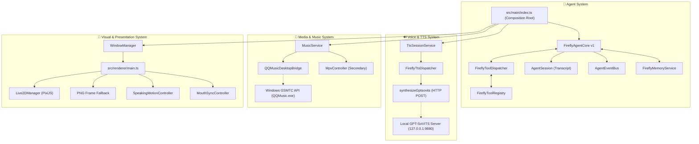

# Firefly-Pet (流萤桌宠) - V1.0.0

> 🚀 **Firefly Desktop AI Agent** — 基于 Electron + TypeScript + PixiJS Live2D + GPT-SoVITS + Windows GSMTC 的流萤桌面智能体。

---

## 📌 版本状态 (Release Status)

- **当前版本**：`V1.0.0`
- **基线状态**：**COMPLETE / FROZEN** (核心基线已完全冻结)
- **基线规范**：[docs/v1/v1-baseline.md](file:///docs/v1/v1-baseline.md)
- **审计报告**：[docs/v1/v1-baseline-audit.md](file:///docs/v1/v1-baseline-audit.md)
- **架构文档**：[docs/architecture/firefly-agent-architecture.md](file:///docs/architecture/firefly-agent-architecture.md)

---

## 🌟 核心特性 (Features)

1. **FireflyAgentCore (智能体核心)**：
   - 深度解耦的 Agent Loop 架构，实现 `IAgentCore` 接口。
   - 支持单轮与多轮 Tool Calling（工具调用），意图自动解析与 Session Transcript 状态写回。
   - 防崩溃事件总线 (`AgentEventBus`) 与防御性消息隔离 (`AgentSession`)。
   - 角色记忆持久化 (`FireflyMemoryService`) 与三维流萤人格约束 (`resources/firefly.yaml`)。

2. **双形态桌面交互与 Live2D 表现 (Live2D Presentation)**：
   - 支持 Live2D Cubism 3 模型 (`Firefly.model3.json`) 渲染，具备鼠标眼球注视追踪。
   - 完备的序列帧回退机制（Normal 20 动作 + SAM 8 动作），模型缺失时无缝回退且零崩溃。
   - 像素级透明度采样（`alphaThreshold: 15`）、鼠标穿透与拖拽交互。

3. **动态流萤 AI Voice (GPT-SoVITS AI Voice)**：
   - 接入本地独立运行的 GPT-SoVITS 推理服务（`http://127.0.0.1:9880/tts`）。
   - 基于流萤音色参考音频实现零样本实时语音合成，杜绝硬编码固定音频。
   - 语音播放状态驱动 Live2D 动作（`talking`）与口型开合（`MouthSyncController`）实时联动。

4. **系统媒体控制 (QQ Music GSMTC)**：
   - 通过 Windows GSMTC (Global System Media Transport Controls) API 深度桥接本地运行的 `QQMusic.exe`。
   - Agent 原生支持查询当前播放曲目、艺术家、进度并执行播放/暂停/切换控制。

---

## 🏗 系统架构 (Architecture)

### 架构全景图



### 关键架构组件

- **`FireflyAgentCore`**：独立核心，与 UI、Live2D、TTS、Music 完全解耦。通过 EventBus 与 Tools 桥接业务逻辑。
- **`AgentSession`**：维护每轮对话的完整状态与 Transcript，采用防御性拷贝防止外部污染。
- **`AgentEventBus`**：封装 `EventEmitter`，为每个监听器提供独立异常隔离，确保第三方监听异常不中断 Agent 主循环。
- **`FireflyTtsDispatcher`**：提供 SHA256 语音缓存、TTS 队列管理与优雅降级机制（离线时不阻断对话）。
- **`QQMusicDesktopBridge`**：基于 Windows PowerShell 与 WinRT GSMTC 接口实现无侵入式桌面媒体控制。

---

## 📁 目录结构 (Directory Structure)

```text
Firefly-Pet/
├── assets/firefly/            # 角色模型、序列帧、特化音效与 UI 资产
│   ├── models/                # Live2D Cubism 3 模型配置与安装目录
│   ├── normal/                # Normal 形态序列帧 (20 动作)
│   ├── sam/                   # SAM 机甲形态序列帧 (8 动作)
│   ├── audio/sam/             # SAM 特化音效资产
│   └── voice_reference/       # GPT-SoVITS 参考音频元数据清单
├── config/                    # 运行时配置、记忆与历史存储 (忽略敏感数据)
│   └── settings.example.json  # 默认配置模板
├── docs/                      # 核心文档
│   ├── architecture/          # 架构全景规范 (firefly-agent-architecture.md)
│   ├── v1/                    # V1 冻结基线 (v1-baseline.md) 与审计报告 (v1-baseline-audit.md)
│   └── v2/                    # V2 规划路线图 (v2-roadmap.md)
├── resources/                 # 角色设定 YAML 与知识库文本
├── src/
│   ├── main/                  # Electron 主进程 (AgentCore, TTS, Music, Windows)
│   ├── preload/               # 上下文隔离 Preload 脚本
│   ├── renderer/              # PixiJS Live2D 渲染与 React 交互 UI
│   └── shared/                # 跨进程类型定义与通信信道
└── tools/                     # 回归测试套件与 Python 资产校验工具
```

---

## 🚀 快速上手 (Quick Start)

### 1. 环境依赖
- **Node.js**: >= 18.0.0
- **操作系统**: Windows 10 / 11 (GSMTC 媒体控制支持)
- **GPT-SoVITS**: 本地独立运行的 GPT-SoVITS 服务（端口 9880）
- **Python**: >= 3.10 (用于运行资产校验脚本)

### 2. 安装与配置
```powershell
# 克隆仓库
git clone https://github.com/Serendipity-wu02/Firefly_Agent.git
cd Firefly_Agent

# 安装依赖
npm install

# 复制默认配置
Copy-Item config/settings.example.json config/settings.json
```

### 3. 本地运行与构建
```powershell
# 类型检查
npm run typecheck

# 编译构建
npm run build

# 启动桌宠 (生产模式)
npm start

# 开发模式 (热重载)
npm run dev
```

---

## 🧪 测试与验证 (Testing & Verification)

Firefly-Pet 配备完整的回归测试体系，包含单元测试、契约测试、实机联调与烟雾测试：

```powershell
# 1. 运行核心回归测试套件 (6 个测试套件，全部通过)
npm test

# 2. 运行 Python 资产与逻辑校验套件
python tools/validate_ai_intent.py
python tools/validate_asset_structure.py
python tools/validate_character_resources.py
python tools/validate_firefly_assets.py
python tools/validate_persistence.py

# 3. 运行实机 GPT-SoVITS 联调测试 (需启动本地 GPT-SoVITS 服务)
node tools/verify_live_voice.mjs

# 4. 运行 Electron 启动与销毁烟雾测试
$env:ELECTRON_SMOKE_TEST="1"; npx electron .
```

---

## 📦 第三方资源与部署说明 (Third-Party Resources)

### 1. Live2D 角色模型
本项目支持加载流萤 Live2D Cubism 3 模型。由于版权与分发限制，**本公开仓库不包含第三方 Live2D 二进制文件**（`.moc3`、贴图 `.png`、音频 `.mp3`）。

- **安装步骤**：
  将流萤 Live2D 模型文件放置于 `assets/firefly/models/` 目录下（包含 `Firefly.model3.json`, `Moc_0.moc3`, `Textures_0_0.png`, `Physics_0.json`, `Expressions/`, `Motions/`）。
- **降级保护**：
  若未放置 Live2D 模型，系统将自动启用内置的 PNG 序列帧动画系统 (`assets/firefly/normal/` 和 `assets/firefly/sam/`)，所有交互与功能均可正常运作。

### 2. GPT-SoVITS 语音服务部署
本项目 AI Voice 采用动态远程/本地 HTTP 推理，**仓库内不包含任何模型 Checkpoint 权重**。

- **推荐开源方案**：[RVC-Boss/GPT-SoVITS](https://github.com/RVC-Boss/GPT-SoVITS)
- **流萤微调权重推荐**：[HuggingFace Waterwzy/GPT-SoVITS-firefly-finetuning](https://huggingface.co/Waterwzy/GPT-SoVITS-firefly-finetuning)
- **服务启动**：
  启动 GPT-SoVITS API 服务并监听本地端口：
  ```bash
  python api_v2.py -a 127.0.0.1 -p 9880
  ```
- **接口地址**：`http://127.0.0.1:9880/tts`

---

## 🗺 V2 路线图 (V2 Roadmap)

> ⚠️ **注意**：V1.0.0 阶段已完全冻结。以下内容仅为规划路线，不包含在当前版本中。

- **V2.1 Agent Core v2**：多步规划循环 (Plan-and-Solve)、子任务状态检查点与动态 Token 压缩。
- **V2.2 Memory v2**：分层认知记忆、SQLite 多命名空间存储与基于遗忘曲线的重要性评分。
- **V2.3 RAG**：星穹铁道设定知识库与本地混合检索 (BM25 + Vector)。

---

## 📄 开源协议 (License)

本项目代码部分基于 [MIT License](LICENSE) 开源。
相关角色形象及衍生资源版权归原权利方所有。
