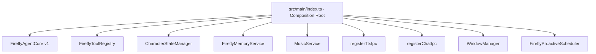
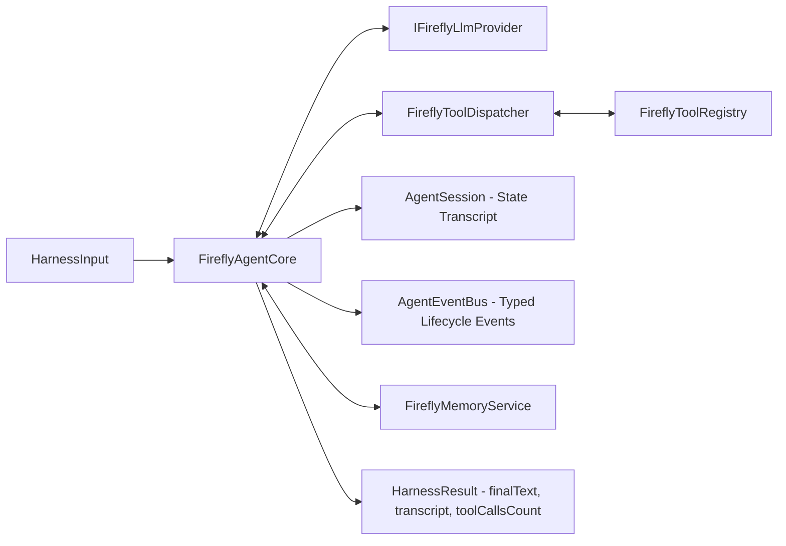

# Firefly-Pet V1 Architecture Specification

## 1. Overview & Composition Root

Firefly-Pet is an Electron + TypeScript desktop companion agent featuring dual-form character interactions (Live2D model with PNG fallback), multi-turn tool-augmented conversations via `FireflyAgentCore`, dynamic zero-shot voice synthesis via local GPT-SoVITS, and Windows desktop media control over QQ Music via GSMTC.

`src/main/index.ts` is the sole **composition root** of the application. Concrete instances are constructed here and injected into consumers via interfaces, ensuring full modular decoupling.



---

## 2. Agent Core (`FireflyAgentCore`)

`FireflyAgentCore` implements `IAgentCore` and maintains an independent agent loop completely decoupled from UI, Live2D, TTS, and Music services.



### Key Components
- **`AgentSession`**: Immutable message transcript accumulation with isolation from external mutation.
- **`AgentEventBus`**: Emits typed lifecycle events (`agent:run-start`, `agent:step-start`, `agent:tool-call-start`, `agent:tool-call-result`, `agent:run-complete`, `agent:error`) wrapped in try-catch guards to prevent third-party listener crashes.
- **`FireflyToolDispatcher`**: Executes tool calls matching registry definitions, captures execution errors, and writes tool results back into the session transcript.
- **`IFireflyLlmProvider`**: Decoupled LLM interface (`LocalFireflyProvider`, `OpenAiFireflyProvider`).

---

## 3. Dynamic Voice Synthesis (GPT-SoVITS TTS Pipeline)

Dynamic AI Voice synthesis is routed to a standalone local GPT-SoVITS server. No model weights reside within the Electron runtime.

```mermaid
flowchart TD
    Chat[Chat Window / Agent Reply] -->|finalText| SessionSvc[TtsSessionService]
    SessionSvc -->|StartTtsRequest| Dispatcher[FireflyTtsDispatcher]
    Dispatcher -->|Cache Check / Miss| Engine[synthesizeGptsovits]
    Engine -->|POST /tts (HTTP JSON)| GptSoVits["Local GPT-SoVITS Server (127.0.0.1:9880)"]
    GptSoVits -->|Firefly Weights Inference| Audio[audio/wav Buffer]
    Audio -->|Base64 Payload| Playback[TtsPlaybackManager (Renderer)]
    Playback -->|PET_SPEAKING_CHANGED(true)| MainProc[Electron IPC Broadcast]
    MainProc -->|onSpeakingChanged(true)| SpeakingMotion[SpeakingMotionController]
    SpeakingMotion -->|playActionId('talking')| Live2DMgr[Live2DManager / Canvas]
    SpeakingMotion -->|start viseme| MouthSync[MouthSyncController]
    Playback -->|audio.onended| StopSpeaking[PET_SPEAKING_CHANGED(false)]
    StopSpeaking -->|playActionId('idle')| RestoreIdle[Live2D Restored to Idle]
```

### Verified Runtime Configuration
- **Endpoint**: `http://127.0.0.1:9880/tts`
- **Reference Audio**: `E:\GPT-SoVITS\GPT-SoVITS-firefly-finetuning\samples\sample_1.wav`
- **Reference Prompt**: `谢谢你，我们快去体验一下附近的游乐设施吧，目标就暂定为——用光所有代币！`
- **Request Fields**: `text`, `text_lang`, `ref_audio_path`, `prompt_text`, `prompt_lang`, `media_type`, `speed_factor`.

---

## 4. Music System & Windows GSMTC Desktop Bridge

Music capability operates in dual modes: direct Windows GSMTC desktop session control over QQ Music, and secondary fallback player execution.

```mermaid
flowchart LR
    Agent[Agent Music Tools] --> MusicSvc[MusicService]
    MusicSvc --> DesktopBridge[QQMusicDesktopBridge]
    DesktopBridge -->|PowerShell GSMTC| WinGSMTC["Windows GSMTC API (QQMusic.exe)"]
    MusicSvc --> FallbackMpv[MpvController (Secondary Fallback)]
    MusicSvc --> Cache[SelectionSetCache]
    MusicSvc --> Session[PlaybackSession]
```

---

## 5. Live2D & Visual Presentation Layer

The presentation tier supports Live2D Cubism 3 rendering (`Firefly.model3.json`) via `@pixi/core` and `pixi-live2d-display`, with complete PNG frame sequence fallback.

- **`Live2DManager`**: Loads Live2D model, motions (`Tick2`, expressions), physics, and handles automatic fallback if assets are unavailable.
- **`SpeakingMotionController`**: Synchronizes voice playback state with character animations (`talking` vs `idle`).
- **`MouthSyncController`**: Viseme opening/closing modulation driven by speaking timers.
- **`InteractionController`**: Alpha-tested drag, head petting, body click, and context menu triggers.
- **`ClickThroughController`**: Transparent pixel alpha threshold sampling (`alphaThreshold: 15`).
