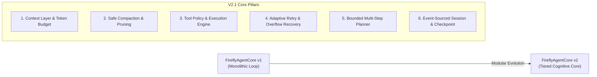
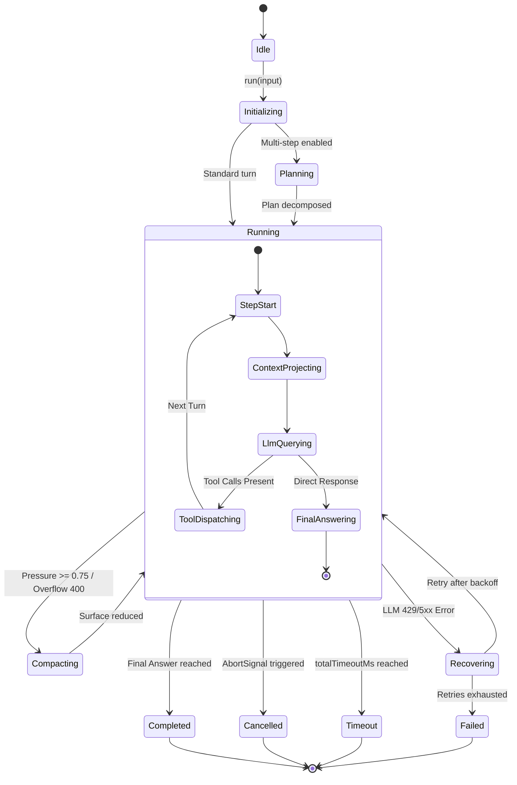
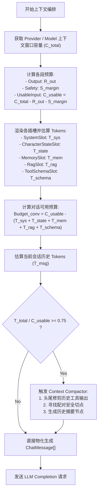
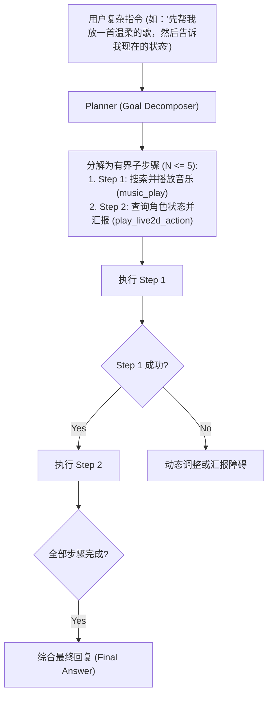

# FireflyAgentCore v2.1 架构设计全景规范 (Architecture Specification)

- **版本**: V2.1 Design Baseline
- **状态**: DESIGN COMPLETE / READY FOR IMPLEMENTATION
- **目标系统**: Firefly-Pet Desktop Companion AI Agent
- **参考架构**: Cyrene-Agent (Playa-0v0/Cyrene-Agent), dsh-harness (deepseek-ai/deepseek-harness)
- **定位**: 自研 Agent Core，非 Cyrene/dsh clone，纯净聚焦于智能体执行循环、上下文编排、工具调用、容灾恢复与生命周期管理。

---

## 1. V1 现状分析与 V2 演进目标

### 1.1 V1 遗留债务与局限
在 Firefly-Pet V1.0.0 中，`FireflyAgentCore` 实现了基础的 ReAct 循环与解耦，但存在以下架构债务：
1. **Context 构建债务**：`FireflyAgentCore` 直接依赖 `src/main/agent/harness/harness-context.ts` 的 `buildRoundMessages()` 与 `buildFireflySystemPrompt()`，上下文组装未模块化。
2. **Context Budget 粗粒度**：缺少动态 Token 计数器，无法按模型窗口自适应分配 System、Memory、Tool Schema 与 Conversation 预算。
3. **Compaction 未与 Core 深度联动**：仅有简单的截断截取，缺少上下文溢出（Context Overflow 400/413）的自动紧急压缩与重试联动。
4. **Tool Policy 仅限于开关**：无法对工具执行实施超时重试、危险操作确认（HITL）、单轮预算与并发策略。
5. **缺少多步规划（Bounded Planning）**：无法在 Core 原生层面对复杂目标进行分解与步骤校验。
6. **Session 为单一数组**：难以支持不可变事件日志（Append-only Event Log）与多视图投影（Materialized View）。

### 1.2 V2.1 演进目标


---

## 2. 外部架构参考与吸收分析

### 2.1 Cyrene-Agent 架构精髓吸收
1. **配对安全切点 (Paired Safe Cut Index)**：
   - 保证 assistant 中的 `toolCalls` 与其紧随的 `role: "tool"` 结果永不被 Compaction 分隔在不同历史片段中，杜绝主流大模型 API（OpenAI, DeepSeek, Anthropic）的 Schema 配对校验错误。
2. **头尾保护式工具输出截断 (Head/Tail Tool Truncation)**：
   - 对超长工具输出（如高密度音乐搜索结果、大型 JSON）在采集阶段立即执行 Head (前 4KB) + Prune Marker + Tail (后 1KB) 截断，防止单次工具输出占满上下文窗口。
3. **组合根单点替换机制 (Composition Root Single-Line Swap)**：
   - 严格维护 `IAgentCore` 顶层契约，使主进程各子系统（`chat-ipc`, `proactive-scheduler`, `agent-orchestrator`）对 Core 内部演进完全无感。

### 2.2 dsh-harness 深度架构启示
| 核心设计问题 | dsh-harness 设计原理 | FireflyAgentCore v2 自研落地策略 |
| :--- | :--- | :--- |
| **1. Compaction 作为 Capability Seam** | 压缩不侵入主循环，作为独立策略接入 | 定义 `ICompactionStrategy` 与 `ContextPressureSensor`，由 Core 声明式调用 |
| **2. Append-Only Session Event Log** | 会话历史单调递增，Surface 为物化视图 | `SessionEventLog` 记录全量事件，`ContextProjector` 按当前 Token 预算物化生成 `ChatMessage[]` |
| **3. Checkpoint Policy 与 Store 分离** | 触发时机策略与物理存储介质解耦 | `ICheckpointPolicy` 控制触发时机，`ICheckpointStore` 支持内存/持久化存储 |
| **4. Request-Error 与 Compaction 联动** | 捕获 400/413 异常直接触发紧急压缩 | `RecoveryManager` 捕获 `context_length_exceeded` 后自动执行 `emergencyCompact()` 并重试 |
| **5. Token Meter 与 Context Pressure** | 动态计算使用率，提前预防性压缩 | $\text{PressureRatio} \ge 0.75 \implies \text{Soft Compact}$；$\ge 0.95 \implies \text{Hard Compact}$ |
| **6. Tool Result Pruning 与 Compaction 关系** | Pruning 为微观即时截断，Compaction 为宏观轮次摘要 | 工具返回时执行 Pruning，轮次超预算时执行 Compaction，两级递进 |
| **7. 生命周期节点驱动能力扩展** | `pre-step`, `on-tool`, `request-error` 拦截点 | 基于 `AgentEventBus` 与 `ExecutionInterceptor` 提供无侵入式生命周期挂钩 |

---

## 3. V2.1 模块结构与分层

```text
src/main/agent/
├── core/                         # Agent Core 主执行层
│   ├── firefly-agent-core-v2.ts  # IAgentCore 实现，主入口
│   ├── agent-loop.ts             # 核心 Agent Loop 状态驱动循环
│   └── agent-state-machine.ts    # 完备的执行状态机定义
├── context/                      # 上下文管理与预算投影层
│   ├── context-manager.ts        # 上下文编排总控
│   ├── context-projector.ts      # 物化投影生成器 (EventLog -> ChatMessage[])
│   ├── system-prompt-builder.ts  # 流萤 3 层人设、状态与动作定义渲染器
│   ├── token-meter.ts            # Token 计算器与模型上下文配额估算
│   └── context-slots.ts          # 动态上下文插槽定义 (System, State, Memory, RAG)
├── compaction/                   # 上下文压缩与修剪层
│   ├── compactor.ts              # 综合压缩器 (Soft / Hard / Emergency)
│   ├── tool-result-pruner.ts     # 工具输出头尾修剪器
│   └── safe-cut.ts               # 配对安全切点计算器
├── policy/                       # 策略规则层
│   ├── tool-policy.ts            # 工具权限、超时、重试、预算策略
│   ├── retry-policy.ts           # LLM 429/5xx 指数退避策略
│   └── context-budget.ts         # 模型上下文窗口预算规范
├── recovery/                     # 容灾与错误恢复层
│   ├── recovery-manager.ts       # 错误分类与恢复协调器
│   └── error-classifier.ts       # 错误类型识别 (RateLimit, Overflow, ServerError)
├── checkpoint/                   # 执行检查点与恢复层
│   ├── checkpoint-manager.ts     # 检查点生命周期管理
│   └── checkpoint-store.ts       # 检查点存储后端 (InMemory / File)
├── planning/                     # 多步规划层 (Bounded Planning)
│   ├── planner.ts                # 目标分解与步骤执行器
│   └── plan-types.ts             # 规划数据结构与状态定义
├── session/                      # 会话与不可变日志层
│   ├── agent-session-v2.ts       # V2 会话门面
│   └── session-event-log.ts      # 不可变事件日志 (Append-Only Event Log)
└── events/                       # 类型化事件系统
    ├── agent-event-bus.ts        # 防崩溃事件总线 (向后兼容 V1)
    └── agent-event-types.ts      # 扩展事件定义
```

---

## 4. 核心接口与数据契约设计

### 4.1 Context Layer 接口
```typescript
export interface IContextSlot {
  readonly id: string;
  readonly priority: number; // 越高越优先保留
  render(ctx: ExecutionContext): Promise<string> | string;
  estimateTokens(ctx: ExecutionContext): number;
}

export interface ContextBudgetConfig {
  contextWindowTokens: number;     // 如 128,000
  reservedOutputTokens: number;    // 如 8,192
  safetyMarginTokens: number;      // 如 512
  systemBudgetRatio: number;       // 默认 0.2
  memoryBudgetRatio: number;       // 默认 0.15
  ragBudgetRatio: number;          // 默认 0.25 (预留)
  conversationBudgetRatio: number; // 默认 0.4
  compactionThreshold: number;     // 默认 0.75
}

export interface IContextProjector {
  project(
    eventLog: ISessionEventLog,
    slots: IContextSlot[],
    budget: ContextBudgetConfig,
  ): Promise<{
    messages: ChatMessage[];
    usage: ContextUsageSnapshot;
    compactionApplied: boolean;
  }>;
}
```

### 4.2 Tool Policy 接口
```typescript
export interface ToolExecutionPolicy {
  toolId: string;
  enabled: boolean;
  timeoutMs: number;
  maxRetries: number;
  maxResultChars: number;
  riskLevel: "safe" | "confirm_required" | "high_risk";
  priority: number;
}

export interface IToolPolicyManager {
  canExecute(toolId: string, ctx: ExecutionContext): { allowed: boolean; reason?: string };
  getPolicy(toolId: string): ToolExecutionPolicy;
  pruneResult(output: string, policy: ToolExecutionPolicy): { output: string; pruned: boolean };
}
```

### 4.3 Recovery & Retry 接口
```typescript
export type ErrorCategory =
  | "RATE_LIMIT_429"
  | "SERVER_ERROR_5XX"
  | "CONTEXT_OVERFLOW"
  | "TOOL_TIMEOUT"
  | "TOOL_EXECUTION_ERROR"
  | "NETWORK_ABORT"
  | "UNRECOVERABLE";

export interface RecoveryAction {
  action: "retry" | "compact_and_retry" | "feed_error_to_llm" | "abort";
  delayMs?: number;
  reason: string;
}

export interface IRecoveryManager {
  classify(error: unknown): ErrorCategory;
  resolveRecovery(category: ErrorCategory, attempt: number): RecoveryAction;
}
```

---

## 5. 状态机规范 (State Machine Specification)

### 5.1 Run 状态迁移图


### 5.2 状态转换规则表
| 当前状态 (Current State) | 触发事件 (Trigger Event) | 目标状态 (Target State) | 附带行为 (Side Effect) |
| :--- | :--- | :--- | :--- |
| `Idle` | `START_RUN` | `Initializing` | 检查配置、初始化 SessionEventLog、注册取消信号 |
| `Initializing` | `PLAN_REQUIRED` | `Planning` | 调用 Planner 进行有界步骤分解 |
| `Initializing` | `DIRECT_START` | `Running.StepStart` | 组装首轮上下文插槽 |
| `Running.ContextProjecting` | `PRESSURE_HIGH` | `Compacting` | 触发软压缩，生成摘要节点 |
| `Running.LlmQuerying` | `OVERFLOW_400` | `Compacting` | 触发紧急硬压缩，修剪工具历史 |
| `Running.LlmQuerying` | `API_429_5XX` | `Recovering` | 启动指数退避计时器，准备重试 |
| `Running.ToolDispatching` | `TOOL_DONE` | `Running.StepStart` | 将工具结果追加至事件日志，步数加 1 |
| `Running` | `ABORT_SIGNAL` | `Cancelled` | 终止所有正在运行的工具与 LLM 请求 |
| `Running` | `TIMEOUT_EXPIRED` | `Timeout` | 记录超时信息并安全收尾 |

---

## 6. Context Budget 与 Token Accounting 编排流程



---

## 7. Context Compaction 流程与配对保护

### 7.1 配对保护算法 (Paired Safe Cut Index)
```text
算法输入：消息列表 nonSystemMessages，保留尾部条数 retainCount
算法输出：安全的切分点 cutIndex

1. cut = nonSystemMessages.length - retainCount
2. WHILE cut > 0 DO:
     IF nonSystemMessages[cut].role == "tool" THEN
         cut = cut - 1  // 切点不能落在 tool 结果上
         CONTINUE
     END IF
     prev = nonSystemMessages[cut - 1]
     IF prev.role == "assistant" AND prev.toolCalls.length > 0 THEN
         cut = cut - 1  // 切点不能切断 assistant.toolCalls 与后续 tool 的联系
         CONTINUE
     END IF
     BREAK
   END WHILE
3. RETURN MAX(0, cut)
```

### 7.2 压缩失败与回滚保护
1. 若 LLM 摘要服务调用失败，自动降级为静态截断摘要：`[前序历史：包含 N 轮对话，已自动修剪]`。
2. 原始会话数据在 `SessionEventLog` 中完整保持，Compaction 仅影响本次发送给模型的 Surface 视图，随时可无损重新物化。

---

## 8. Tool Policy 与结果管理

### 8.1 结构化工具策略
- **安全等级划分**：
  - `safe`（默认）：如 `play_live2d_action`, `music_status`, `music_search`，直接并行或串行执行。
  - `confirm_required`：如涉及文件修改或外部高敏感操作，需触发 `agent:tool-confirm-required` 事件。
- **并发控制**：
  - 只读工具（Read-only Tools）支持并发执行 (`Promise.allSettled`)。
  - 具有副作用的工具（State Mutation Tools）保持严格串行执行。
- **结果修剪策略 (Tool Result Pruning)**：
  - 当单个工具返回字符数 $> 8,192$ 字符时，自动触发头尾采样截断（保留前 4,096 字符与后 1,024 字符），中间插入标记 `[... tool result middle pruned ...]`。

---

## 9. Checkpoint / Resume 机制

### 9.1 Checkpoint 结构体
```typescript
export interface ExecutionCheckpoint {
  runId: string;
  sessionId: string;
  step: number;
  state: RunState;
  transcriptVersion: number;
  plan?: ExecutionPlan;
  toolStateSnapshot?: Record<string, unknown>;
  createdAt: number;
  updatedAt: number;
}
```

### 9.2 崩溃恢复与可恢复性
- **Electron 意外退出防护**：在每次工具执行前及每轮 Step 完成后，将 Checkpoint 异步写入本地持久化存储。
- **Resume 逻辑**：应用重启后，若检测到未完成的 Checkpoint，可选择继续未完成步骤或以优雅提示通知用户。

---

## 10. 多步 Planning (Bounded Multi-Step Planning)



---

## 11. 未来扩展接口预留 (Memory v2 & RAG)

### 11.1 Memory v2 预留接口 (V2.2)
```typescript
export interface IMemoryProvider extends IContextSlot {
  readonly id: "memory-slot";
  remember(key: string, value: string, meta?: Record<string, unknown>): Promise<boolean>;
  forget(key: string): Promise<boolean>;
  retrieveMemories(query: string, limit?: number): Promise<MemoryItem[]>;
}
```

### 11.2 RAG 知识库预留接口 (V2.3)
```typescript
export interface IKnowledgeProvider extends IContextSlot {
  readonly id: "rag-slot";
  searchKnowledge(query: string, topK?: number): Promise<Array<{ text: string; score: number; source: string }>>;
}
```
**隔离保证**：Memory v2 与 RAG 仅作为 `IContextSlot` 挂载到 `ContextSlotManager`，其向量数据库、嵌入模型与存储细节对 `FireflyAgentCore` 完全黑盒。

---

## 12. 结论

`FireflyAgentCore v2.1` 架构彻底解除了 V1 的 Harness 依赖债务，构建了模块化、高弹性、可恢复且具备有界规划能力的新一代桌面智能体核心，为后续 V2.2 记忆系统与 V2.3 RAG 检索铺平了道路。
