# Firefly-Agent V2.1 (Phase A-D) 总体架构集成审计报告

- **审计对象**: FireflyAgentCore V2.1 整体架构 (Phase A Context + Phase B Compaction + Phase C Tool Policy + Phase D Recovery & Durability)
- **审计模式**: 深度静态分析与全量运行验证（禁止代码修改）
- **审计结论**: **V2.1 A-D INTEGRATION: PASS / READY FOR PHASE E: YES**

---

## A. Phase A-D 总体架构图 (Overall Architecture)

```mermaid
flowchart TD
    subgraph CoreLayer ["🧠 FireflyAgentCore V2.1 (Orchestrator)"]
        Core["FireflyAgentCore.run() / resume()"]
        Session[("AgentSession\n(Immutable / Append-only History)")]
        ExecState["RunExecutionState\n(Active Control Flow & State Machine)"]
    end

    subgraph PhaseA_B ["📐 Context & Compaction Layer"]
        CM["ContextManager"] --> Slots["ContextSlots (System / State / Memory / RAG)"]
        CM --> Meter["TokenMeter (Single Source of Truth)"]
        CM --> Budget["ContextBudget (Pressure Calculation)"]
        CM --> Projector["ContextProjector"]
        Projector --> Compactor["ContextCompactor (Soft / Hard / Emergency)"]
        Compactor --> Pruner["ToolResultPruner (Head + Tail Snipping)"]
        Compactor --> SafeCut["PairedSafeCut (Tool Call-Result Pairing)"]
    end

    subgraph PhaseC ["🛡️ Tool Policy & Execution Engine"]
        EE["ToolExecutionEngine"] --> Evaluator["ToolPolicyEvaluator (Whitelist / Blacklist / Risk)"]
        EE --> Batcher["ToolBatchPlanner (Read-only Parallel / Mutation Serial)"]
        EE --> Timeout["Timeout Controller (AbortSignal.timeout)"]
        EE --> ToolRetry["Tool Transient Retry (Exponential Backoff)"]
        EE --> ToolResPolicy["ToolResultPolicy (Bounds using ToolResultPruner)"]
        EE --> Dispatcher["FireflyToolDispatcher"]
        Dispatcher --> Registry["FireflyToolRegistry"]
    end

    subgraph PhaseD ["💾 Recovery & Durability Layer"]
        RM["RecoveryManager (Bounded Budget)"] --> ErrClass["ErrorClassifier (400, 429, 5xx, Network)"]
        ErrClass -->|400 Overflow| EmComp["Emergency Compaction Trigger"]
        ErrClass -->|429 RateLimit| Backoff["Rate Limit Backoff Retry"]
        
        CPManager["CheckpointManager"] --> CPPolicy["DefaultCheckpointPolicy"]
        CPManager --> CPStore["FileCheckpointStore (Atomic Write / Quarantine)"]
        Resume["ResumeProtocol"] --> SideEffectSafety["Interrupted Tool Sanitization"]
    end

    Core --> CM
    Core --> EE
    Core --> RM
    Core --> CPManager
    Core --> Session
    Core --> ExecState
```



---

## B. 实际依赖图 (Actual Dependency Graph)

| 核心调用源 | 目标模块 | 依赖类型 | 说明 |
| :--- | :--- | :--- | :--- |
| `FireflyAgentCore` | `src/main/agent/context/context-manager.ts` | **Runtime Dependency** | 上下文组装与投影映射 |
| `FireflyAgentCore` | `src/main/agent/execution/tool-execution-engine.ts` | **Runtime Dependency** | 工具策略评估、并发与超时执行 |
| `FireflyAgentCore` | `src/main/agent/recovery/checkpoint-manager.ts` | **Runtime Dependency** | 运行级快照捕获与恢复 |
| `FireflyAgentCore` | `src/main/agent/recovery/recovery-manager.ts` | **Runtime Dependency** | 大模型请求异常分类与预算化自愈 |
| `FireflyAgentCore` | `src/main/agent/recovery/resume-protocol.ts` | **Runtime Dependency** | 断点安全校验与副作用修补 |
| `FireflyAgentCore` | `src/main/agent/agent-session.ts` | **Runtime Dependency** | 内存级会话历史存储 |
| `FireflyAgentCore` | `src/main/agent/agent-events.ts` | **Runtime Dependency** | 统一事件总线 (Typed Event Emitter) |
| `FireflyAgentCore` | `src/shared/harness-types.ts` | **Type-only Dependency** | 输入输出与配置契约 (`HarnessInput`, `HarnessResult`) |
| `FireflyAgentCore` | `src/shared/agent-core.ts` | **Type-only Dependency** | 统一核心接口 (`IAgentCore`) |
| `ContextProjector` | `src/main/agent/compaction/compactor.ts` | **Runtime Dependency** | 压力超限时触发无损投影压缩 |
| `ToolResultPolicy` | `src/main/agent/compaction/tool-result-pruner.ts` | **Runtime Dependency** | 工具输出超限时复用唯一 Pruner 逻辑 |

---

## C. Harness 债务审计 (Harness Debt Audit)

经全局 Grep 检索代码库：
1. **`harness-context.ts` 运行时依赖**: **0 处**（仅旧测试桩 `firefly-harness.ts` 引用，`FireflyAgentCore` 完全无直接或间接依赖）。
2. **`tool-round.ts` / `tool-truncation.ts` 运行时依赖**: **0 处**（完全被 Phase C `ToolExecutionEngine` 与 `ToolResultPolicy` 取代）。
3. **`FireflyHarness` 类**: **仅作为 V1 冻结参考存在**，未参与任何运行时生产调用或新版集成。
4. **共享类型 `harness-types.ts`**: 纯类型契约，无运行时逻辑债务。

---

## D. Context / Compaction 审计

1. **投影纯度 (Projection Purity)**:
   - Compaction 仅针对 `ContextProjector.project()` 生成的 LLM 临时上下文视图生效；
   - `AgentSession` 与原始消息数组在经过 Soft、Hard、Emergency 压缩后**保持 100% 不变与完整**。
2. **工具配对安全性 (Tool Call / Result Pairing)**:
   - `PairedSafeCut` 算法严格将 `assistant.toolCalls` 与对应的 `role: "tool"` 视为原子语义单元，杜绝悬空或单边截断。
3. **Token 计算单一数据源 (Single Token Meter)**:
   - 全局仅使用 `TokenMeter` 计算 token（区分 estimate 与 actual），消除双重计算误差。
4. **Emergency Compaction 与 Recovery 连接**:
   - 当大模型抛出 400 上下文溢出时，`RecoveryManager` 触发 `retry_with_compaction`，直接调用 `contextManager.project({ forceCompactionStrategy: "emergency" })` 完成最小视图修整并重试。

---

## E. Tool Execution 审计

1. **重试职责严格解耦 (No Retry Confusion)**:
   - **工具级重试 (Tool Retry)**：严格由 Phase C `ToolExecutionEngine` 处理（仅针对网络超时等暂态错误，非暂态错误立即阻断）；
   - **大模型级重试 (Provider Recovery)**：严格由 Phase D `RecoveryManager` 处理（针对 400/429/5xx）；
   - 两套机制互不重叠，杜绝工具被多层重复调用。
2. **Pruner 单一数据源**:
   - `ToolResultPolicy` 直接复用 Phase B `ToolResultPruner`，确保头尾修剪格式与标记完全一致。
3. **并发与串行规则生效**:
   - 只读工具（`read_only` / `idempotent`）通过 `Promise.all` 安全并发；
   - 状态变更工具（`state_mutation` / `external_action`）严格单步串行执行。

---

## F. Recovery 审计

1. **错误分级体系**:
   - `400 / 413` $\rightarrow$ `context_overflow` (触发 Emergency Compaction $\rightarrow$ 1次尝试);
   - `429` $\rightarrow$ `rate_limit` (触发指数退避 $delay = initial \times 2^{attempt} \rightarrow$ 重试);
   - `500 / 502 / 503 / 504 / ECONNRESET` $\rightarrow$ `server_error / network_error` (限定次数瞬态重试);
   - `401 / 403 / Model Not Found / Abort` $\rightarrow$ `fatal / cancelled` (立即终止，禁止重试).
2. **预算耗尽保护 (Bounded Budget)**:
   - 全局限制 `maxRecoveryAttempts = 3`，`maxOverflowRetries = 1`；
   - 杜绝 `error -> recovery -> error -> recovery` 递归死循环。

---

## G. Checkpoint 审计

1. **脱敏安全性 (Safe Serialization)**:
   - 序列化过程强制过滤不可持久化对象（`AbortController`、`Promise`、音频流、Electron 窗口句柄、Tool 实例）；
   - 仅持久化纯数据（`runId`, `sessionId`, `step`, `runState`, `messages: ChatMessage[]`, `activeToolCalls` 等）。
2. **原子写入与版本校验**:
   - `FileCheckpointStore` 采用 `${id}.tmp` 写入后原子重命名至 `${id}.json`，防止写一半断电导致文件损坏；
   - 引入 `version === CHECKPOINT_SCHEMA_VERSION` 校验，损坏或版本不匹配文件被安全捕获隔离，不崩溃进程。

---

## H. Session / ExecutionState / Checkpoint 三层边界

```text
┌─────────────────────────────────────────────────────────────┐
│ 1. AgentSession (内存层 - 会话完整历史)                      │
│    - append-only ChatMessage[] 历史记录                     │
│    - 任何 Compaction / 临时裁剪均不修改此结构               │
├─────────────────────────────────────────────────────────────┤
│ 2. RunExecutionState (运行时控制层 - 现场瞬态)              │
│    - 包含 runState, stepState, activeToolCalls, 恢复计数器  │
│    - 仅在内存中维护当前 Run 的调度与状态机转移              │
├─────────────────────────────────────────────────────────────┤
│ 3. Checkpoint (持久化层 - 现场不可变快照)                   │
│    - RunExecutionState 状态元数据 + 脱敏的消息历史快照      │
│    - 具有版本号、时间戳与触发原因，支持断点原子恢复         │
└─────────────────────────────────────────────────────────────┘
```

---

## I. Side Effect 防重复与断点恢复审计

1. **终态安全阻断**:
   - `runState === "completed"` 与 `runState === "cancelled"` 的快照**绝对禁止自动恢复**（防滥用与违背用户取消意图）。
2. **未决工具状态修补**:
   - 针对崩溃前处于 `started` 或 `unknown` 的工具调用，恢复协议主动在重构消息流中注入 `interrupted_prior_to_completion` 错误节点；
   - 模型在恢复后的第一轮推理中获知前序工具被意外中断，可根据业务意图决定重试或回滚，**绝不产生盲目二次破坏性外部调用**。

---

## J. Event Model 完整性审计

| 分类 | 事件类型 (`type`) | 状态 |
| :--- | :--- | :--- |
| **V1 Core** | `agent:started`, `agent:step-start`, `agent:llm-request`, `agent:assistant-message`, `agent:tool-call`, `agent:tool-result`, `agent:final-answer`, `agent:cancelled`, `agent:error`, `agent:finished` | **100% 保留且契约兼容** |
| **Phase C** | `tool:authorized`, `tool:denied`, `tool:retry`, `tool:timeout` | **正常分发** |
| **Phase D** | `checkpoint:created`, `checkpoint:restored`, `recovery:started`, `recovery:completed`, `recovery:failed`, `run:resumed` | **正常分发** |

---

## K. 未来扩展架构准备度 (Future Extensibility)

1. **Memory v2 准备度**:
   - `ContextSlots` 中已独立预留 `MemorySlot`；
   - 引入 Memory v2 只需实现动态插槽渲染，**完全无需修改 Agent Loop 或 Tool Engine**。
2. **RAG 准备度**:
   - `ContextSlots` 中已独立预留 `RagSlot`；
   - 引入检索增强只需向 `RagSlot` 注入检索分块，**完全无需修改 Agent Loop 或 Tool Engine**。
3. **桌面端与多模态解耦**:
   - `QQMusic`、`GPT-SoVITS TTS`、`Live2D` 均作为标准 Tool 或外部服务桥接存在，未侵入 Agent Core 内部状态。

---

## L. 全量测试与 V1 回归验证 (100% Pass)

```text
> firefly-agent@1.0.0 test

✔ test_firefly_agent_core_freeze.mjs   (12/12 PASS)
✔ test_firefly_agent_core_v1.mjs       (12/12 PASS)
✔ test_firefly_voice_v1.mjs            (7/7 PASS)
✔ test_llm_tts_live2d_chain.mjs        (3/3 PASS)
✔ test_music_system.mjs                (8/8 PASS)
✔ test_qqmusic_desktop_bridge.mjs      (9/9 PASS)
✔ test_v2_phase_a_context.mjs          (6/6 PASS)
✔ test_v2_phase_b_compaction.mjs       (12/12 PASS)
✔ test_v2_phase_c_tool_policy.mjs      (13/13 PASS)
✔ test_v2_phase_d_recovery_durability.mjs (12/12 PASS)

总计: 94 项自动化单元与集成测试 全部通过 (0 Failures)
TypeScript 静态类型检查: 0 Errors
Production Build 编译: Clean Build
GPT-SoVITS 真实语音服务联调: 12/12 Checks PASS
Electron 启动 Smoke Test: Code 0 Clean Exit
```

---

## M. 风险评估与准入结论

- **架构冲突 / 循环依赖**: 无。
- **状态污染 / 内存泄漏**: 无，状态划分清晰，快照脱敏完善。
- **Harness 债务**: 彻底解除运行时耦合。

```text
==================================================
        V2.1 A-D INTEGRATION: PASS
        READY FOR PHASE E: YES
==================================================
```
