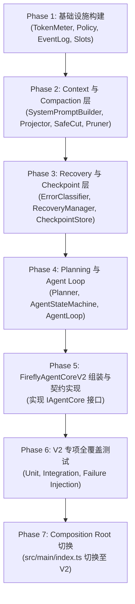

# FireflyAgentCore V2.1 迁移与实施方案 (Migration Plan)

- **目标**: 将 Firefly-Pet 智能体核心从 V1 平滑演进至 V2.1，彻底解决 `harness-context.ts` 依赖债务。
- **原则**: 零破坏性变更，100% 保持现有 V1 功能与全部回归测试通过，支持单点回滚。

---

## 1. 迁移文件清单分类

### A. 新增模块与文件 (New Files)
```text
src/main/agent/core/
├── firefly-agent-core-v2.ts      # V2 智能体主类 (实现 IAgentCore)
├── agent-loop.ts                 # 状态驱动执行主循环
└── agent-state-machine.ts        # 状态机与状态迁移引擎

src/main/agent/context/
├── context-manager.ts            # 上下文管理与插槽协调器
├── context-projector.ts          # 物化视图生成器 (EventLog -> ChatMessage[])
├── system-prompt-builder.ts      # 流萤人设/状态/动作组装器 (取代 harness-context)
├── token-meter.ts                # 动态 Token 计数与上下文压力计算
└── context-slots.ts              # 插槽抽象 (System, State, Memory, RAG)

src/main/agent/compaction/
├── compactor.ts                  # 多级压缩器 (Soft/Hard/Emergency)
├── tool-result-pruner.ts         # 头尾保护式工具输出截断器
└── safe-cut.ts                   # 配对安全切点计算器

src/main/agent/policy/
├── tool-policy.ts                # 工具执行策略 (权限、超时、重试)
├── retry-policy.ts               # LLM 429/5xx 指数退避策略
└── context-budget.ts             # 模型上下文配额预算管理

src/main/agent/recovery/
├── recovery-manager.ts           # 错误分类与容灾恢复协调器
└── error-classifier.ts           # 异常模式匹配识别器

src/main/agent/checkpoint/
├── checkpoint-manager.ts         # 检查点创建与状态持久化
└── checkpoint-store.ts           # 内存与本地文件检查点后端

src/main/agent/planning/
├── planner.ts                    # 有界多步规划器 (Bounded Planner)
└── plan-types.ts                 # 目标分解与步骤数据结构

src/main/agent/session/
├── agent-session-v2.ts           # V2 会话外观
└── session-event-log.ts          # 不可变事件日志 (Append-Only Event Log)

src/main/agent/events/
├── agent-event-bus.ts            # 增强型防崩溃事件总线 (支持 V1 全部事件 + V2 扩展)
└── agent-event-types.ts          # 扩展生命周期事件定义
```

### B. 修改文件 (Modified Files - 仅在最终切换阶段)
- `src/main/index.ts`: 组合根中将 `new FireflyAgentCore(...)` 切换为 `new FireflyAgentCoreV2(...)`。

### C. 保留并作为回退的文件 (Preserved Files)
- `src/main/agent/firefly-agent-core.ts`: V1 原版保留，用于 A/B 测试与基线回滚。
- `src/main/agent/agent-session.ts`: V1 会话保留。
- `src/main/agent/agent-events.ts`: V1 事件总线保留。
- `src/main/agent/harness/*`: 历史参考实现与工具函数完整保留。

### D. 严禁改动的文件 (Untouched Files)
- `src/main/tts/*` (GPT-SoVITS 语音引擎与分发)
- `src/main/music/*` (QQ 音乐桌面桥接与播放会话)
- `src/renderer/*` (PixiJS Live2D 渲染与 React 交互)
- `src/main/memory/memory-service.ts` (保持 Memory v1 稳定)
- `assets/*` (全部角色资产与模型定义)

---

## 2. 分阶段实施路线 (Phase Sequence)



---

## 3. 测试策略与回归矩阵

### 3.1 V2 专项测试套件设计
1. **Context 预算与压力测试** (`tools/test_v2_context_budget.mjs`):
   - 测试不同模型窗口下的预算动态分配。
   - 测试达到 75% 阈值时的软压缩触发。
2. **安全切点与配对保护测试** (`tools/test_v2_compaction_pairing.mjs`):
   - 构造包含 10 轮以上多工具调用的复杂上下文，验证压缩后工具与结果 100% 配对。
3. **错误分类与自动恢复测试** (`tools/test_v2_recovery_matrix.mjs`):
   - 模拟 429 RateLimit（指数退避验证）。
   - 模拟 400 Context Overflow（紧急压缩 + 单次重试恢复验证）。
   - 模拟 Tool Timeout（安全转为 tool output 验证）。
4. **有界规划测试** (`tools/test_v2_bounded_planning.mjs`):
   - 复杂多意图指令（如“查状态并放歌”）自动分解与按序执行。
5. **V1 兼容契约测试** (`tools/test_v2_v1_contract.mjs`):
   - 验证 `FireflyAgentCoreV2` 接收 V1 全部入参并产生符合 `HarnessResult` 标准的输出。

### 3.2 现有 V1 回归测试基线保护
所有现有 V1 测试必须持续保持 100% PASS：
- `npm test`
- `node tools/test_firefly_agent_core_freeze.mjs`
- `node tools/test_firefly_agent_core_v1.mjs`
- `node tools/test_firefly_voice_v1.mjs`
- `node tools/test_llm_tts_live2d_chain.mjs`
- `node tools/test_music_system.mjs`
- `node tools/test_qqmusic_desktop_bridge.mjs`
- `python tools/validate_*.py`
- `node tools/verify_live_voice.mjs`
- `$env:ELECTRON_SMOKE_TEST="1"; npx electron .`

---

## 4. 回滚方案 (Rollback Plan)

由于本次演进严格遵循面向接口设计（`IAgentCore`）：
1. **即时回滚**：若 V2 在集成时出现未预期的边界问题，只需在 `src/main/index.ts` 中恢复引用：
   ```typescript
   // 快速回滚单行代码：
   import { FireflyAgentCore } from "./agent/firefly-agent-core";
   const agentCore = new FireflyAgentCore({ ... });
   ```
2. **零副作用**：V2 的所有新增类库均位于独立子目录中，不破坏 V1 的任何逻辑分支与状态持久化。

---

## 5. 风险清单与应对策略

| 风险项 (Risk) | 严重度 | 概率 | 应对策略 (Mitigation) |
| :--- | :--- | :--- | :--- |
| **Token 估算偏差导致 LLM 偶发溢出** | 中 | 中 | 设置 512~1024 Tokens 安全裕量 (`safetyMarginTokens`)，捕获 400 自动触发 Emergency Compaction |
| **工具配对切点遗漏** | 高 | 低 | 采用经过充分数学验证的 `findPairedSafeCutIndex` 算法并加入单测穷举断言 |
| **复杂规划死循环** | 高 | 低 | 设定硬性步数上限 (`maxSteps = 5`)，超时自动截断并合成已完成结果 |
| **V1 事件监听器不兼容** | 中 | 低 | `AgentEventBus` 严格保持 V1 全部 10 种事件名称与 Payload 定义完全不变 |
