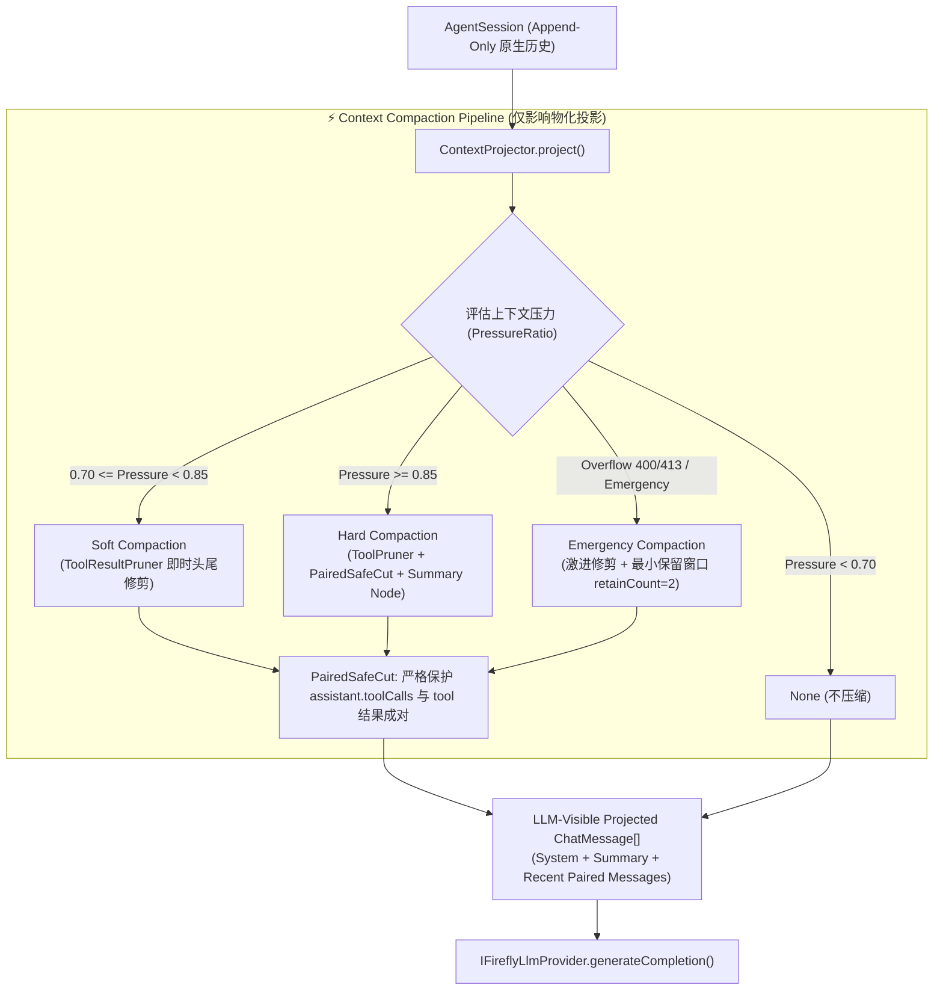

# FireflyAgentCore V2.1 - Phase B: Compaction Layer 实施报告

- **实施阶段**: Phase B (Compaction Layer & Tool Pruning)
- **状态**: COMPLETE / 100% VERIFIED
- **目标**: 建立独立的 Context Compaction 系统，提供头尾保护式工具修剪、配对安全切分与多级压缩机制，严格保护 Session 原始历史与大模型 Tool Pair 语法语义完整性。

---

## 1. 核心架构与设计原则 (Compaction Architecture)



### 核心设计原则
1. **仅物化投影压缩 (Projection-Only Mutation)**：Compaction 只生成供 LLM 当前请求使用的临时 `ChatMessage[]` 视图，**绝不修改、删除或污染 `AgentSession` 中的不可变原始事件历史**。
2. **工具配对绝对保护 (Paired Safe Cut)**：确保 `assistant.toolCalls` 与对应的 `role: "tool"` 结果永远在切分边界的同一侧，彻底杜绝孤立工具调用或孤立工具结果导致的 API 400 校验错误。
3. **分级弹性压缩 (Tiered Strategies)**：提供 Soft（工具修剪）、Hard（历史摘要）、Emergency（溢出激进压缩）三级策略。
4. **失败安全 (Failure Safety)**：所有压缩执行均受防御性异常捕获保护，任何意外错误均优雅回退至原始投影，确保 Agent Loop 永不崩溃。

---

## 2. 关键组件实现说明

### 2.1 Tool Result Pruning (`src/main/agent/compaction/tool-result-pruner.ts`)
- **配置项**：`maxResultChars` (默认 4,096)、`headChars` (默认 2,048)、`tailChars` (默认 512)、`middleMarker`、`preserveErrors` (错误结果保护)。
- **小结果零开销**：字符数 $\le \text{maxResultChars}$ 的结果原样返回，不产生额外字符串拷贝开销。
- **超长结果采样**：保留头部核心元数据与尾部执行状态摘要，中间插入修剪提示。

### 2.2 Paired Safe Cut (`src/main/agent/compaction/safe-cut.ts`)
- **切点判定算法**：
  1. 初始切点设为 `cut = nonSystemMessages.length - retainCount`；
  2. 若 `messages[cut]` 为 `role: "tool"`，说明切点落在工具结果序列中，向前移动 `cut--`，将该工具结果及其所属 assistant 一并保留在活跃窗口；
  3. 若 `messages[cut - 1]` 为携带 `toolCalls` 的 assistant，说明其工具结果即将落在切点后，向前移动 `cut--`，防止 assistant 与工具结果被切断；
  4. 循环直到切点位于完全安全的非工具消息边界。
- **完整性校验**：内置 `PairedSafeCut.validateIntegrity()`，对切分后的消息数组进行前向状态机扫描，断言无悬挂调用或孤立结果。

### 2.3 Context Compactor (`src/main/agent/compaction/compactor.ts`)
- **Soft Compaction**：仅批量修剪历史工具消息中的超长内容，不压缩任何对话文本。
- **Hard Compaction**：先修剪工具输出 $\rightarrow$ 配对安全切分 $\rightarrow$ 物化 `[前序对话历史摘要：开拓者与流萤进行了 N 轮交流，执行了 M 次工具调用...]` Summary 节点 $\rightarrow$ 拼接活跃尾部消息。
- **Emergency Compaction**：针对大模型 400 Context Overflow 的紧急自愈路径，采用最小保留窗口 (`retainCount = 2`) 与激进修剪参数 (`maxResultChars = 1,024`)。

---

## 3. 新增与修改文件清单

### 3.1 新增文件 (New Files)
```text
src/main/agent/compaction/
├── tool-result-pruner.ts     # 工具输出头尾修剪器
├── safe-cut.ts               # 配对安全切点计算器与完整性校验器
└── compactor.ts              # 综合压缩器 (Soft / Hard / Emergency)

tools/
└── test_v2_phase_b_compaction.mjs # Phase B Compaction 全场景覆盖测试套件 (12/12 Tests)
```

### 3.2 修改文件 (Modified Files)
- `src/main/agent/context/context-projector.ts`:
  - 引入 `ContextCompactor`，在物化投影流程中根据 `usage.pressureRatio` 或显式策略自动触发相应 Compaction，并更新投影后的 Token 使用量快照。
- `src/main/agent/context/context-manager.ts`:
  - 接入 `compactorOptions` 的配置管理与传递支持。
- `package.json`:
  - 将 `test_v2_phase_b_compaction.mjs` 加入 `npm test` 自动化测试流水线。

---

## 4. 测试与回归验证结果 (Test Verification)

| 序号 | 验证项 | 执行命令 | 结果 |
| :--- | :--- | :--- | :--- |
| 1 | TypeScript 静态类型检查 | `npm run typecheck` | **PASS (0 Errors)** |
| 2 | 生产环境完整编译打包 | `npm run build` | **PASS (Clean Build)** |
| 3 | Phase B Compaction 专项测试 | `node tools/test_v2_phase_b_compaction.mjs` | **PASS (12/12 Tests)** |
| 4 | Phase A Context 专项测试 | `node tools/test_v2_phase_a_context.mjs` | **PASS (6/6 Tests)** |
| 5 | Agent Core 冻结测试 | `node tools/test_firefly_agent_core_freeze.mjs` | **PASS (12/12 Tests)** |
| 6 | Agent Core V1 对话与工具测试 | `node tools/test_firefly_agent_core_v1.mjs` | **PASS (12/12 Tests)** |
| 7 | 语音契约测试 | `node tools/test_firefly_voice_v1.mjs` | **PASS (7/7 Tests)** |
| 8 | LLM-TTS-Live2D 链路测试 | `node tools/test_llm_tts_live2d_chain.mjs` | **PASS (3/3 Tests)** |
| 9 | 音乐系统测试 | `node tools/test_music_system.mjs` | **PASS (8/8 Tests)** |
| 10 | QQ 音乐桌面桥接测试 | `node tools/test_qqmusic_desktop_bridge.mjs` | **PASS (9/9 Tests)** |
| 11 | Python 意图校验 | `python tools/validate_ai_intent.py` | **PASS** |
| 12 | Python 资产结构校验 | `python tools/validate_asset_structure.py` | **PASS** |
| 13 | Python 角色资源校验 | `python tools/validate_character_resources.py` | **PASS** |
| 14 | Python 动作帧校验 | `python tools/validate_firefly_assets.py` | **PASS** |
| 15 | Python 持久化校验 | `python tools/validate_persistence.py` | **PASS** |
| 16 | 本地 GPT-SoVITS 实机联调 | `node tools/verify_live_voice.mjs` | **PASS (12/12 Checks)** |
| 17 | Electron 启动烟雾测试 | `$env:ELECTRON_SMOKE_TEST="1"; npx electron .` | **PASS (Exit Code 0)** |

---

## 5. 准入评估 (Readiness for Phase C)

- **投影隔离性**: 已验证原始 `AgentSession` 保持 100% 原始历史，Compaction 仅在物化投影层运作。
- **配对完整性**: 单/多轮工具调用在切分后 100% 保持语法与语义配对。
- **回归测试状态**: 全部 17 项测试套件 100% PASS。

```text
==================================================
        PHASE B: COMPACTION COMPLETE
==================================================
        READY FOR PHASE C (TOOL POLICY): YES
==================================================
```
