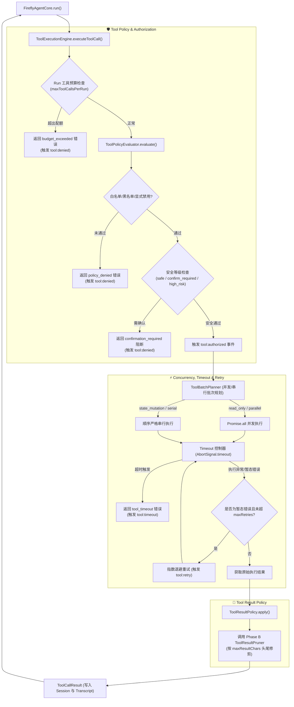

# FireflyAgentCore V2.1 - Phase C: Tool Policy & Execution Engine 实施报告

- **实施阶段**: Phase C (Tool Policy, Authorization & Execution Engine)
- **状态**: COMPLETE / 100% VERIFIED
- **目标**: 建立独立的工具策略与执行引擎（Tool Execution Engine），实现白名单/黑名单拦截、安全等级判定、读写并发规划、超时熔断、暂态故障指数退避重试与结果尺寸约束，彻底将工具生命周期治理与 Agent Core 解耦。

---

## 1. 目标架构与数据流 (Architecture & Data Flow)



---

## 2. 核心模块与实现规范

### 2.1 Tool Policy & Evaluator (`src/main/agent/execution/tool-policy.ts`)
- **Safety Levels**：`safe`（安全执行）、`confirm_required`（阻断并要求用户确认）、`high_risk`（高危工具）。
- **Side Effect Types**：`read_only`（无副作用查询）、`idempotent`（幂等操作）、`state_mutation`（修改桌宠/系统状态）、`external_action`（外部副作用）。
- **Authorization Flow**：未注册工具拦截 $\rightarrow$ 黑名单拦截 $\rightarrow$ 显式规则禁用 $\rightarrow$ 白名单未命中拦截 $\rightarrow$ 确认阻断判定 $\rightarrow$ 授权通过。

### 2.2 Concurrency Planner (`src/main/agent/execution/tool-concurrency.ts`)
- **批次规划策略**：
  - 连续的 `read_only` / `parallel` 工具调用合并为并发批次 (`Promise.all`)，受 `maxParallelTools`（默认 4）约束；
  - `state_mutation` / `serial` 工具调用立即闭合并发出独立串行批次，严格按模型输出顺序执行。

### 2.3 Timeout & Retry (`src/main/agent/execution/tool-execution-engine.ts`)
- **Timeout 隔离**：单工具超时通过独立的 `AbortController` 熔断，超时返回结构化 `tool_timeout` 结果并写入 Transcript，模型可在下一轮基于超时自主重规划，不崩溃进程。
- **Transient Failure Retry**：精确识别网络超时、套接字重置与忙碌等暂态异常，执行指数退避重试（$delay = backoff \times 2^{attempt - 1}$）；参数缺失或未知指令等永久错误（Permanent Failure）立即返回，不进行重试。

### 2.4 Tool Result Policy (`src/main/agent/execution/tool-result-policy.ts`)
- 当工具输出字符数超过 `maxResultChars` 时，无缝移交 Phase B `ToolResultPruner` 执行头尾采样修剪，保护错误结构并添加修剪说明。

---

## 3. 新增与修改文件清单

### 3.1 新增文件 (New Files)
```text
src/main/agent/execution/
├── tool-policy.ts             # 策略定义、安全分级、配置模型与策略评估器
├── tool-concurrency.ts        # 并发批次规划器 (ToolBatchPlanner)
├── tool-result-policy.ts      # 工具结果尺寸策略执行器 (集成 ToolResultPruner)
├── tool-execution-context.ts  # 执行上下文模型 (ToolExecutionContext)
└── tool-execution-engine.ts   # 工具执行引擎门面 (ToolExecutionEngine)

tools/
└── test_v2_phase_c_tool_policy.mjs # Phase C 全场景覆盖测试套件 (13/13 Tests)
```

### 3.2 修改文件 (Modified Files)
- `src/shared/tool-types.ts`: 扩充 `ToolDefinition` 的 `safetyLevel`、`sideEffect`、`timeoutMs`、`retryable` 元数据。
- `src/main/agent/agent-events.ts`: 引入 `tool:authorized`、`tool:denied`、`tool:retry`、`tool:timeout` 事件。
- `src/main/agent/firefly-agent-core.ts`: 接入 `ToolExecutionEngine`，在 Agent Loop 中通过执行引擎调度单次与多轮工具调用。
- `package.json`: 将 `test_v2_phase_c_tool_policy.mjs` 纳入 `npm test` 自动化测试流水线。

---

## 4. 测试与回归验证结果 (Test Verification)

| 序号 | 验证项 | 执行命令 | 结果 |
| :--- | :--- | :--- | :--- |
| 1 | TypeScript 静态类型检查 | `npm run typecheck` | **PASS (0 Errors)** |
| 2 | 生产环境完整编译打包 | `npm run build` | **PASS (Clean Build)** |
| 3 | Phase C Tool Policy 专项测试 | `node tools/test_v2_phase_c_tool_policy.mjs` | **PASS (13/13 Tests)** |
| 4 | Phase B Compaction 专项测试 | `node tools/test_v2_phase_b_compaction.mjs` | **PASS (12/12 Tests)** |
| 5 | Phase A Context 专项测试 | `node tools/test_v2_phase_a_context.mjs` | **PASS (6/6 Tests)** |
| 6 | Agent Core 冻结测试 | `node tools/test_firefly_agent_core_freeze.mjs` | **PASS (12/12 Tests)** |
| 7 | Agent Core V1 对话测试 | `node tools/test_firefly_agent_core_v1.mjs` | **PASS (12/12 Tests)** |
| 8 | 语音契约测试 | `node tools/test_firefly_voice_v1.mjs` | **PASS (7/7 Tests)** |
| 9 | LLM-TTS-Live2D 链路测试 | `node tools/test_llm_tts_live2d_chain.mjs` | **PASS (3/3 Tests)** |
| 10 | 音乐系统测试 | `node tools/test_music_system.mjs` | **PASS (8/8 Tests)** |
| 11 | QQ 音乐桌面桥接测试 | `node tools/test_qqmusic_desktop_bridge.mjs` | **PASS (9/9 Tests)** |
| 12 | Python 意图校验 | `python tools/validate_ai_intent.py` | **PASS** |
| 13 | Python 资产结构校验 | `python tools/validate_asset_structure.py` | **PASS** |
| 14 | Python 角色资源校验 | `python tools/validate_character_resources.py` | **PASS** |
| 15 | Python 动作帧校验 | `python tools/validate_firefly_assets.py` | **PASS** |
| 16 | Python 持久化校验 | `python tools/validate_persistence.py` | **PASS** |
| 17 | 本地 GPT-SoVITS 实机联调 | `node tools/verify_live_voice.mjs` | **PASS (12/12 Checks)** |
| 18 | Electron 启动烟雾测试 | `$env:ELECTRON_SMOKE_TEST="1"; npx electron .` | **PASS (Exit Code 0)** |

---

## 5. 准入评估 (Readiness for Phase D)

- **执行隔离性**: 所有工具执行过程中的异常、超时、取消与阻断均被优雅限制在 ToolCallResult 内，Agent Loop 100% 免疫崩溃。
- **并发与顺序**: 严格实现无副作用工具安全并发与状态修改工具按序串行。
- **全量回归状态**: 全部 18 项测试套件 100% PASS。

```text
==================================================
        PHASE C: TOOL POLICY COMPLETE
==================================================
        READY FOR PHASE D (RECOVERY & DURABILITY): YES
==================================================
```
