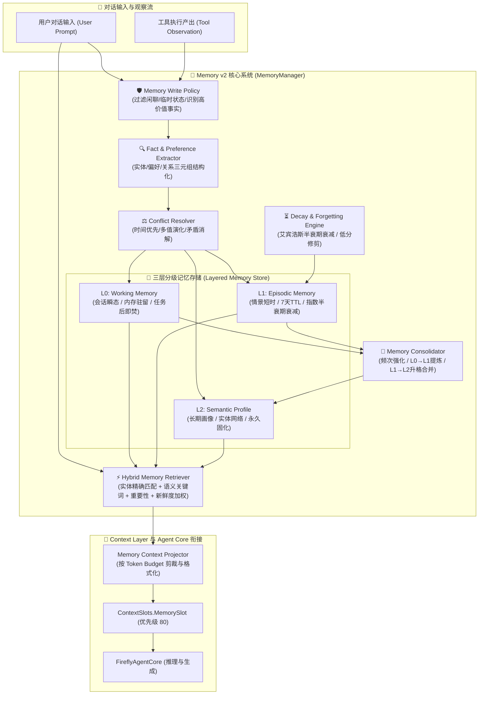

# Firefly-Agent V2.2: Memory v2 架构设计规范

- **版本**: V2.2 Architecture Specification
- **阶段**: Architecture & Implementation Plan
- **目标**: 为 Firefly-Agent 构建具备三层分级（L0 工作记忆 / L1 情景短时记忆 / L2 核心语义画像）、实体与关系建模、偏好管理、重要性评估、时间半衰期衰减、冲突消解、混合召回与严格写入策略的自研记忆体系（Memory v2）。

---

## 1. 核心架构与分层数据流 (Architecture Overview)



---

## 2. 详细数据模型设计 (Data Models)

### 2.1 基础枚举与模型
```typescript
export type MemoryLayer = "L0_WORKING" | "L1_EPISODIC" | "L2_SEMANTIC";

export type MemoryScope = "global" | "user" | "character" | "session";

export type MemoryCategory =
  | "profile"        // 基础画像 (名字, 生日, 称谓, 身份)
  | "preference"     // 明确喜好与禁忌 (饮食, 音乐, 话题, 习惯)
  | "entity"         // 具名实体 (人物, 物品, 地点, 项目)
  | "relation"       // 实体间关系 (开拓者-喜欢-橡木蛋糕卷)
  | "event"          // 重要里程碑事件与约定 (相遇, 约定, 共同经历)
  | "working_state"; // 会话临时状态

export type MemoryPriority = "critical" | "high" | "normal" | "low";

export interface MemoryEntry {
  id: string;                      // 唯一标识 (mem_*)
  layer: MemoryLayer;              // 所属层级 (L0 / L1 / L2)
  category: MemoryCategory;        // 分类
  scope: MemoryScope;              // 作用域 (默认 user)
  key: string;                     // 实体主键 / 检索主词
  value: string;                   // 记忆内容明文
  summary?: string;                // 紧凑摘要 (用于高压上下文)
  entities?: string[];             // 关联实体 ID / 名称列表
  importance: number;              // 重要性得分 0.0 - 1.0
  confidence: number;              // 置信度 0.0 - 1.0
  accessCount: number;             // 历史被召回使用次数 (强化因子)
  createdAt: number;               // 创建时间戳
  updatedAt: number;               // 更新时间戳
  lastAccessedAt: number;          // 最后召回时间戳
  expiresAt?: number;              // 过期时间戳 (L0/L1 专属)
  source: string;                  // 来源 ("user_explicit" | "chat_extract" | "system" | "tool")
  pinned?: boolean;                // 永久固化 (免疫自然衰减)
  metadata?: Record<string, unknown>; // 扩展属性 (如 relations, preference 详情)
}
```

### 2.2 实体与关系模型 (Entity & Relation Graph)
```typescript
export interface EntityNode {
  id: string;
  name: string;
  type: "person" | "item" | "place" | "concept" | "event";
  aliases?: string[];
  description: string;
  importance: number;
  updatedAt: number;
}

export interface RelationEdge {
  id: string;
  subject: string;                 // 主体 (Entity ID 或 "user" / "firefly")
  predicate: string;               // 谓词 (例如 "喜欢", "讨厌", "居住在", "拥有", "约定")
  object: string;                  // 客体 (Entity ID 或 描述值)
  sentiment?: "positive" | "negative" | "neutral";
  confidence: number;
  sourceMemoryId?: string;
  updatedAt: number;
}
```

### 2.3 偏好结构模型 (Preference Model)
```typescript
export interface PreferenceItem {
  id: string;
  category: "food" | "music" | "topic" | "interaction" | "habits" | "custom";
  subject: string;                 // 偏好对象 (如 "古典乐", "辛辣食物")
  polarity: "like" | "dislike" | "neutral" | "favorite" | "taboo";
  intensity: number;               // 强度 1 - 5 (5: 绝对偏好/绝对禁忌)
  reason?: string;                 // 偏好原因/补充说明
  updatedAt: number;
}
```

---

## 3. 三层记忆体系职责划分 (L0 / L1 / L2)

| 特征 | L0: Working Memory | L1: Episodic Memory | L2: Semantic Profile |
| :--- | :--- | :--- | :--- |
| **定位** | 当前任务与会话瞬态现场 | 近期互动情景与短时约定 | 核心用户画像与长期稳定事实 |
| **生命周期** | 单次 Run / 当前 Session | 7 天 (默认 TTL) | 永久 (除非显式要求遗忘) |
| **存储介质** | 纯内存 Map | 持久化 JSON / WAL 缓存 | 原子持久化 JSON (`memory_v2.json`) |
| **典型内容** | 正在播放第几首、当前多步计划中间态 | “昨晚开拓者提到有点失眠”、“商量好周末听歌” | 用户叫开拓者、生日5月2日、对坚果过敏、偏好舒缓轻音乐 |
| **淘汰与升格**| 会话结束即焚，高价值事实写入 L1 | 随时间指数衰减；被频繁召回 $(\ge 3次)$ 自动升格为 L2 | 永不自然衰减，支持版本更新与合并 |

---

## 4. 算法与策略机制 (Algorithms & Policies)

### 4.1 重要性评分模型 (Importance Scoring)
综合考量显式声明度、持久度和情绪/事件强度：
$$Score_{importance} = \max(0.1, \min(1.0, 0.4 \cdot S_{explicit} + 0.4 \cdot S_{durable} + 0.2 \cdot S_{salience}))$$
- **基础画像 (姓名/生日/禁忌)**: $Importance = 0.95$；
- **明确偏好**: $Importance = 0.75 - 0.85$；
- **普通短时约定**: $Importance = 0.50 - 0.65$；
- **弱推断事实**: $Importance = 0.30 - 0.45$。

### 4.2 衰减与遗忘机制 (Decay & Forgetting)
L1 记忆采用指数半衰期模型，结合召回频次强化：
$$Score_{current}(t) = Importance \times e^{-\lambda \cdot (t - t_{lastAccessed})} \times (1 + 0.2 \cdot \ln(1 + accessCount))$$
- 当 $Score_{current}(t) < 0.15$ 且超过容量上限时触发安全修剪。
- L2 记忆与标记为 `pinned: true` 的条目**完全免疫衰减**。

### 4.3 冲突消解机制 (Conflict Resolution)
1. **单值属性时间最新优先 (Latest Overwrite with Audit)**:
   - 如用户更名或修改生日，新值覆盖旧值，旧值保留在 `metadata.history` 中。
2. **多值偏好共存与权重更新 (Multi-preference Coexistence)**:
   - 喜好变更（如从喜欢摇滚乐变为更喜欢轻音乐），两者并存，但赋予新偏好更高 `intensity` 与 `updatedAt`。
3. **直接反转矛盾消除 (Contradiction Invalidation)**:
   - 出现逻辑互斥（“喜欢甜食” vs “讨厌甜食”），新声明强制降低旧记录置信度并置为失效，防止 System Prompt 出现自相矛盾。

### 4.4 混合召回机制 (Hybrid Retrieval)
检索评分融合 4 个维度：
$$Score_{retrieval} = 0.4 \cdot Match_{entity} + 0.3 \cdot Match_{text} + 0.2 \cdot Importance + 0.1 \cdot Recency$$
- 按总得分倒序排序，受 Token 预算约束截取 Top-K；
- 精简去重后格式化为紧凑字符串输出给 `MemorySlot`。

### 4.5 写入策略控制网 (Memory Write Policy)
- **准入放行**: 显式个人事实、偏好禁忌、人际关系、明确日程约定；
- **直接丢弃**: 纯闲聊寒暄（“哈哈”、“今天天气真好”）、临时会话指令、问答交互废话。

---

## 5. 系统边界与架构隔离 (Boundary Isolation)

1. **Agent Core 解耦**: Core 仅在 Run 入口触发 `retrieve`，在 Run 结束时异步调用 `observe`，不包含任何记忆存储与评分逻辑。
2. **Context Layer 解耦**: ContextManager 仅面向 `IContextSlot` 协议，不感知 Memory v2 的内部结构。
3. **RAG 边界隔离**: Memory v2 负责私有主观动态画像，V2.3 RAG 负责公共客观世界观文档，两者通过独立插槽（`MemorySlot` 与 `RagSlot`）并行注入。
4. **外部多模态解耦**: Memory 模块 100% 独立于 Live2D、TTS 与 QQ Music。
