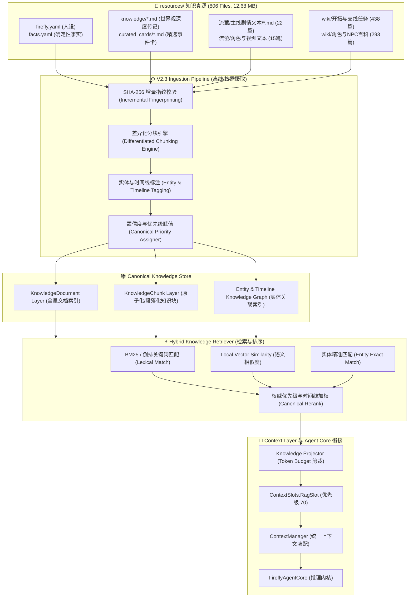

# Firefly-Agent V2.3: RAG 知识检索系统架构设计规范 (RAG Architecture Specification)

- **版本**: V2.3 Architecture & Ingestion Design Baseline
- **知识库真源**: `E:\Google-Antigravity\working\Firefly-Pet\resources\` (806 Files, 12.68 MB)
- **阶段**: Architecture & Resource Ingestion Design (0 Runtime Modification)
- **目标**: 将 `resources/` 官方设定与剧情全量文本建设为高精度、可追溯、分层分级的 Canonical Knowledge Corpus，为未来 `RagSlot` 提供结构化知识检索支持。

---

## 1. 架构总览与分层数据流 (Architecture Overview)



---

## 2. 知识库数据模型设计 (Knowledge Data Models)

```typescript
export type KnowledgeSourceType =
  | "yaml_persona"        // firefly.yaml 核心人设
  | "yaml_fact"           // facts.yaml 封闭事实表
  | "lore_markdown"       // knowledge/*.md 深度世界观
  | "curated_card"        // knowledge/curated_cards/*.md 精选卡片
  | "script_markdown"     // 流萤/主线剧情文本/*.md 官方主线剧本
  | "character_game_text" // 流萤/角色游戏文本/*.md 角色故事与台词
  | "official_media_text" // 流萤/官方视频文本/*.md 官方短片通讯
  | "wiki_trailblaze"     // wiki/开拓任务 & 续闻 全主线台词
  | "wiki_quest"          // wiki/冒险任务 & 同行任务 支线
  | "wiki_character"      // wiki/角色/*.txt 全自机角色百科
  | "wiki_npc";           // wiki/NPC/*.txt 常驻 NPC 百科

export type CanonicalConfidence = "canon" | "official_script" | "curated_wiki" | "general_wiki";

export interface KnowledgeMetadata {
  perspective: "first_person" | "third_person" | "dialogue_transcript" | "factual_assertion";
  sourceFile: string;
  characters: readonly string[];
  scene?: string;
  timelineEpoch?: "glamoth" | "stellaron_hunter" | "penacony" | "amphoreus" | "universal";
  verified: boolean;
}

/**
 * 知识源元数据 (KnowledgeSource)
 */
export interface KnowledgeSource {
  id: string;                         // src_*
  uri: string;                        // 相对 resources 的标准化路径
  type: KnowledgeSourceType;          // 源类型
  sha256: string;                     // 文件 SHA-256 指纹
  fileSizeBytes: number;              // 原始文件字节数
  canonicalPriority: number;          // 权威优先级 (0.50 ~ 1.00)
  totalChunks: number;                // 产出 Chunk 数量
  lastIngestedAt: number;             // 摄取时间戳
}

/**
 * 知识文档 (KnowledgeDocument)
 */
export interface KnowledgeDocument {
  id: string;                         // doc_*
  sourceId: string;                   // 关联的 KnowledgeSource ID
  title: string;                      // 文档标题
  contentType: KnowledgeSourceType;
  canonicalPriority: number;
  entities: readonly string[];        // 涉及的核心实体列表
  summary?: string;                   // 紧凑文档摘要
  chunks: readonly string[];          // 包含的 Chunk ID 列表
  totalTokens: number;                // 文档总 Token 预估
}

/**
 * 知识切片 (KnowledgeChunk)
 */
export interface KnowledgeChunk {
  id: string;                         // chunk_*
  documentId: string;                 // 所属文档 ID
  chunkIndex: number;                 // 在文档内的序号
  chunkType: "atomic_fact" | "heading_section" | "curated_card" | "dialogue_scene" | "character_profile" | "wiki_block";
  text: string;                       // 明文切片内容
  tokenEstimate: number;              // Token 预估大小
  headingPath?: readonly string[];    // Markdown 标题路径 (如 ["失熵症", "医疗舱"])
  entityNames: readonly string[];     // 切片中提及的实体列表
  keywords: readonly string[];        // 检索关键词
  canonicalPriority: number;          // 权威优先级 (1.00 最高)
  metadata: KnowledgeMetadata;        // 扩展元数据
}
```

---

## 3. 权威优先级阶梯体系 (Canonical Priority Hierarchy)

当不同知识源涉及相同事件或实体时，RAG 检索与消歧严格按照真实性真源阶梯赋权：

| 优先级 (Priority) | 分值权重 | 覆盖资源路径 | 权威性定位与选用规则 |
| :---: | :---: | :--- | :--- |
| **P1 (最高)** | **1.00** | `resources/firefly.yaml` | **角色核心三维人格规范**。涉及流萤自我认知、禁忌词与说话风格时拥有绝对裁决权。 |
| **P2** | **0.95** | `resources/knowledge/facts.yaml` | **经核验的确定性第一人称封闭事实表**。查询命中必出，提供精确 Zero-hop 事实断言。 |
| **P3** | **0.90** | `resources/流萤/角色游戏文本/`, `官方视频文本/` | **米哈游官方角色故事、语音与短片台词**。官方真源剧本文档。 |
| **P4** | **0.85** | `resources/knowledge/firefly_lore.md`, `curated_cards/*.md` | **流萤第一人称传记与原子化精选卡片**。高密度事件与心路历程。 |
| **P5** | **0.80** | `resources/流萤/主线剧情文本/` (22 篇) | **匹诺康尼 2.0~2.3 完整主线全剧情实录**。详尽对话与场景上下文。 |
| **P6** | **0.75** | `resources/knowledge/*_lore.md` (6 篇) | **翁法罗斯、罗浮、雅利洛、空间站深度世界观档案**。跨星球宏大叙事背景。 |
| **P7** | **0.60** | `resources/wiki/开拓任务/`, `开拓续闻/`, `角色/` | **银河全主线与 98 位自机角色百科 Dump**。全量泛知识查询。 |
| **P8** | **0.50** | `resources/wiki/冒险任务/`, `同行任务/`, `NPC/` | **银河支线任务与常驻 NPC 百科**。补充细节与背景环境。 |

---

## 4. 混合检索与排序模型设计 (Hybrid Retrieval Engine)

未来 V2.3 RAG 将融合 5 个维度的确定性评分：

$$Score_{RAG} = 0.35 \cdot Match_{entity} + 0.25 \cdot Match_{lexical} + 0.20 \cdot Match_{semantic} + 0.10 \cdot Priority_{canonical} + 0.10 \cdot Relevance_{timeline}$$

1. **`Match_entity` (实体精准匹配, 35%)**:
   - 若用户的提问精准命中 Chunk 的 `entityNames`（如提问“萨姆”、“格拉默”、“白厄”、“艾利欧”），赋予满分 $1.0$；
2. **`Match_lexical` (倒排关键词匹配, 25%)**:
   - 基于 BM25 / Token 倒排索引的高频词命中率；
3. **`Match_semantic` (向量余弦相似度, 20%)**:
   - 基于轻量文本向量模型（如 `bge-small-zh`）计算语义嵌入相似度；
4. **`Priority_canonical` (权威优先级, 10%)**:
   - 直接乘以 Chunk 的 `canonicalPriority`（P1: 1.0 $\sim$ P8: 0.5）；
5. **`Relevance_timeline` (时间线匹配度, 10%)**:
   - 根据当前提问涉及的剧情时期（如“匹诺康尼时期” vs “格拉默旧时代”）进行时序匹配加权。

---

## 5. Memory v2 与 RAG 的绝对架构隔离

```text
┌────────────────────────────────────────────────────────────────────────┐
│                   FIREFLY-AGENT COGNITIVE BOUNDARIES                   │
├───────────────────────────────────┬────────────────────────────────────┤
│   CANONICAL KNOWLEDGE (RAG)       │      PERSONALIZED MEMORY (V2.2)    │
│  （客观世界真理与角色出厂记忆）       │    （用户个性化动态记忆与交互状态）   │
├───────────────────────────────────┼────────────────────────────────────┤
│ • 流萤的基因代号是 AR-26710         │ • 开拓者（用户）在现实中的名字或代号 │
│ • 萨姆是火萤IV型战略强袭装甲       │ • 开拓者喜欢听的音乐风格与歌手偏好  │
│ • 流萤患有失熵症，需要医疗舱       │ • 开拓者昨晚和流萤聊天的情绪状态   │
│ • 匹诺康尼第三次死亡发生在晖长石号 │ • 开拓者与流萤上周许下的某个约定   │
│ • 翁法罗斯白厄的 3300 万次死循环   │ • 用户对桌宠交互频率与动作的喜好   │
│ • 星核猎手同伴卡芙卡、银狼、刃     │ • 对话过程中的短期工作状态与会话上下文│
└───────────────────────────────────┴────────────────────────────────────┘
```

- **隔离铁律**:
  1. `resources/` 知识库永远是只读的，任何对话交互绝不写回 `resources/`；
  2. `resources/` 内容绝不写入 `MemoryStore`（`memory_v2.json`）；
  3. `ContextManager` 通过两个平级插槽（`MemorySlot` 与 `RagSlot`）独立渲染、拼接注入。

---

## 6. RagSlot 与 ContextManager 接入规范

### 6.1 插槽定义与优先级
- **插槽标识**: `RagSlot` (`id = "rag"`, `priority = 70`)；
- **排布顺序**:
  - `SystemPromptSlot` (100) $\rightarrow$ `CharacterStateSlot` (90) $\rightarrow$ `MemorySlot` (80) $\rightarrow$ **`RagSlot` (70)** $\rightarrow$ `ToolSchemaSlot` (60) $\rightarrow$ `PlanSlot` (50)。

### 6.2 投影格式规范 (Knowledge Projection Format)
```text
【相关世界与剧情背景】
• [流萤背景] 前格拉默铁骑「萨姆」驾驶员，编号 AR-26710。因基因改造罹患失熵症。
• [匹诺康尼] 第三次死亡是真正的仪式，也是烟花绚烂的开始。
• [同伴情报] 银狼精通黑客技术，曾被黑塔封禁76个账号。
```

### 6.3 Token 预算控制
- **RAG 预算上限**: 默认分配 **800 Tokens**（与 MemorySlot 的 500 Tokens 严格独立）；
- **动态截断**: 若检索出的 Top-K 知识总长超出 800 Tokens，按得分从低到高安全修剪，确保总体 System Prompt 严格在安全阈值内。

---

## 7. 增量摄取与指纹校验机制 (Incremental Ingestion)

为支持未来 `resources/` 文件的追加与修订，摄取引擎设计轻量级的状态指纹机：

1. **SHA-256 指纹跟踪**: 维护 `resources/.rag_index/manifest.json`，记录每个文件的 `path`、`sha256`、`chunkCount` 与 `lastUpdated`；
2. **增量判定**:
   - **新增文件 (New)**: 自动分块并追加到 Chunk 索引；
   - **修改文件 (Modified)**: 移除旧文档的所有 Chunks，重新执行分块并写入；
   - **删除文件 (Deleted)**: 级联清理对应的 Document 与 Chunk 索引；
   - **未变更文件 (Unchanged)**: 跳过分块与嵌入计算，实现秒级冷启动。
